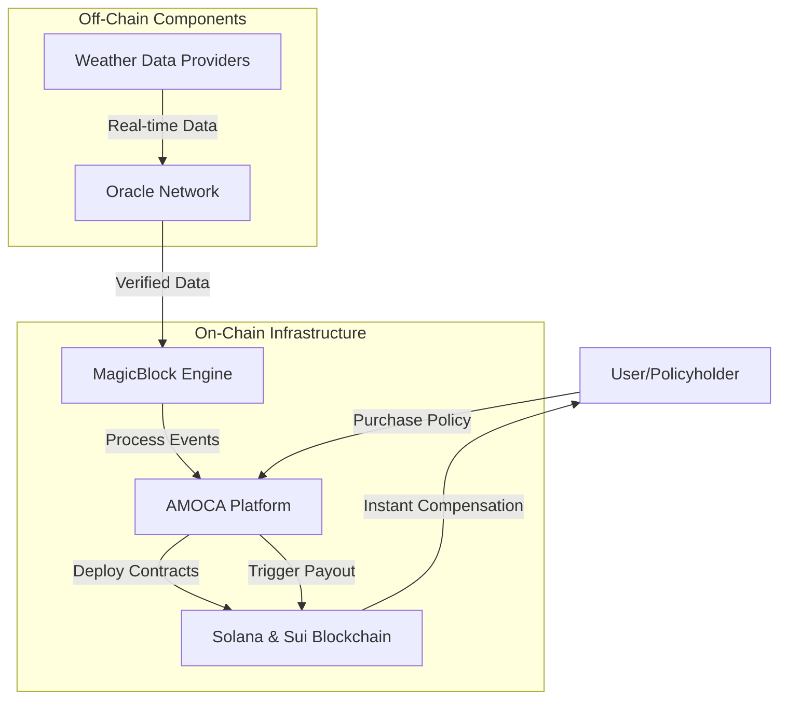
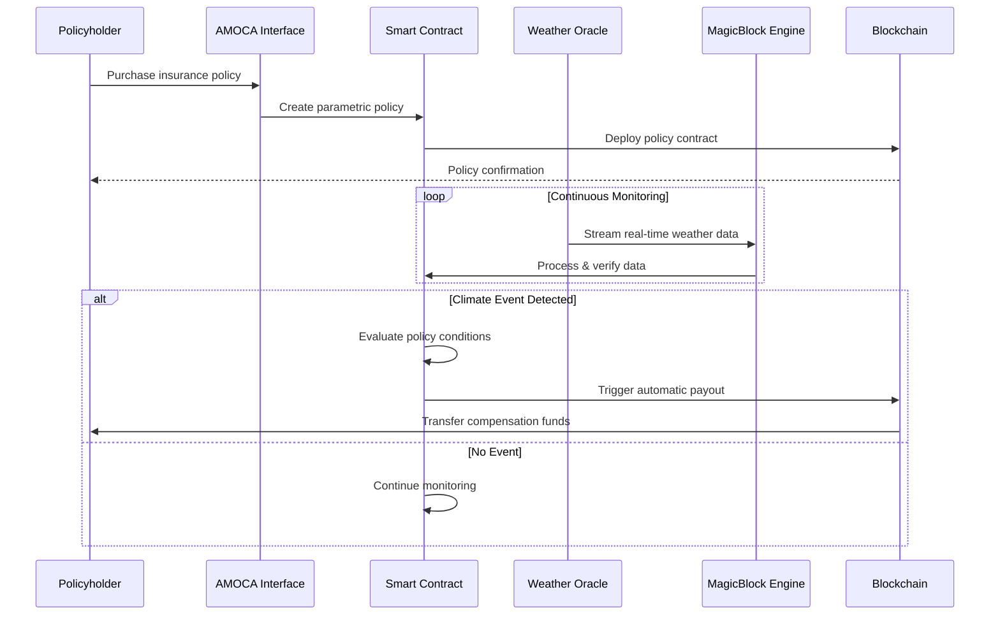
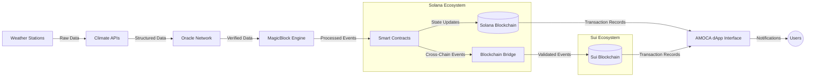

# AMOCA: Decentralized Climate Insurance Platform

  
   
  <em>Meet the AMOCA Climate Guardian - Protecting your future against climate uncertainties</em>

## Overview

AMOCA is building a decentralized climate insurance platform that provides affordable protection against climate-related risks. By leveraging Solana and Sui blockchains, AMOCA triggers instant, automated payouts based on verified weather data, creating a reliable safety net against climate change impacts.

## Key Features

- **Decentralized Insurance**: Truly peer-to-peer protection against climate risks
- **Blockchain-Powered**: Built on Solana and Sui for speed, reliability, and transparency
- **Instant Payouts**: Automated claim processing triggered by verified weather data
- **Affordable Protection**: Lower costs through smart contract efficiency
- **Real-time Data Integration**: Utilizes MagicBlock's high-performance engine for real-time weather data processing

## Technology Stack

### Solana & Sui Blockchain

AMOCA utilizes these high-performance blockchains to ensure:

- Fast transaction processing
- Low fees compared to traditional insurance
- Complete transparency of contracts and claims
- Immutable record keeping

### MagicBlock Engine Integration

AMOCA leverages MagicBlock's high-performance engine to overcome traditional blockchain limitations for real-time climate data applications.

#### Why MagicBlock?

MagicBlock is an extension of the Solana network designed for high-performance decentralized applications. It enhances Solana's capabilities while preserving its composability and integrity.

While blockchain technology is revolutionizing decentralized applications, it still faces fundamental challenges in:

- **Latency**: Blockchain transaction speeds are too slow for real-time applications
- **Cost**: Even "low-fee" blockchains can become expensive at scale
- **Scalability**: Current architectures struggle to handle high-throughput applications

MagicBlock solves these issues with an ephemeral rollup, enabling developers to build dApps that require 10 ms state transitions, gasless transactions, and horizontal scaling.

#### Built on Solana's Ecosystem and Performance

MagicBlock operates as a specialized Solana Virtual Machine (SVM) runtime, seamlessly integrating with Solana's base layer. Developers deploying programs on Solana are fully compatible with the ephemeral rollup down to the bytecode, benefiting from the SVM's high performance and robust ecosystem.

## How AMOCA Works

1. **Data Collection**: Real-time climate and weather data is collected and verified through oracle networks
2. **Smart Contract Creation**: Insurance policies are encoded as smart contracts on Solana/Sui
3. **Risk Assessment**: AI-driven risk models determine premiums based on location-specific climate data
4. **Automated Triggers**: When predefined climate events occur, contracts automatically execute
5. **Instant Payout**: Claims are settled immediately without traditional manual processing

## Benefits for Users

- No paperwork or lengthy claim processes
- Transparent terms and conditions
- Lower premiums through reduced operational costs
- Immediate liquidity when disaster strikes
- Coverage for previously uninsurable climate risks

## Architecture

### System Overview

### Insurance Claims Process

### Data Flow Architecture

## Getting Started

[Coming soon: Installation instructions, API documentation, and developer guides]

## Contributing

We welcome contributions to the AMOCA platform! Please see our contributing guidelines for more information.

## License

[License information to be added]

## Contact

For more information about AMOCA, please contact:
[Contact information to be added]
